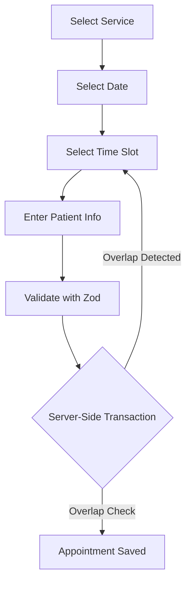
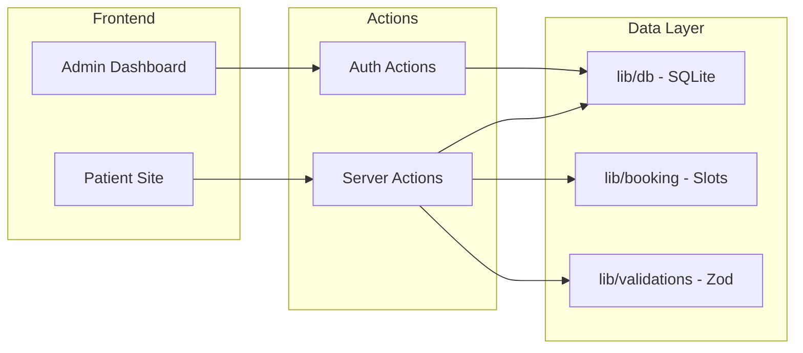
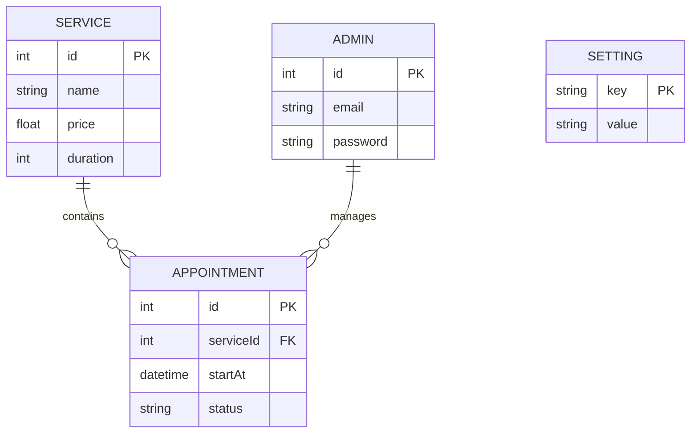

<p align="center">
  
  
  
  
  
</p>

<h1 align="center">BELLEVUE</h1>
<h3 align="center">Medical Practice Management System</h3>

<p align="center">
  <em>Real-time booking, transactional integrity, and administrative control.</em>
</p>
<!-- LIVE DEMO URL -->
<p align="center">
  <strong>Live Demo:</strong> <a href="https://cabinet-medical-five.vercel.app/">cabinet-medical-five.vercel.app</a>
</p>


<!-- PROJECT SCREENSHOT -->
<p align="center">
  
</p>

---

## Core Features

| Patient Experience | Administrative Backend |
| :--- | :--- |
| Animated Single-Page Application (Framer Motion) | Secure Admin Authentication (bcrypt, HTTP-only cookies) |
| Multi-Step Real-Time Booking Flow | Appointment Confirm / Cancel / Complete Management |
| Dynamic Time-Slot Computation (Opening Hours) | Editable Practice Settings (Phone, Hours, Address) |
| WhatsApp `wa.me` Deep Linking | Daily Operational Statistics & Queue Overview |

---

## Booking Pipeline



The final submission is wrapped in a SQLite `TRANSACTION`, re-checking time-slot overlaps immediately before insert. This guarantees **no double-booking**, even under race conditions.

---

## Architecture



- **`app/`**: Next.js App Router (Server Components)
- **`components/`**: UI Components (Patient + Admin)
- **`actions/`**: Server Actions (Booking, Auth, Settings)
- **`lib/db/`**: Database Access Layer
- **`lib/booking/`**: Time-Slot Algorithms
- **`lib/validations/`**: Shared Zod Schemas

---

## Database Schema



---

## Getting Started

```bash
npm install
npx tsx scripts/seed.ts
npm run dev
```

**Admin Panel:** `http://localhost:3000/admin/login`  
**Demo Credentials:** `admin@bellevue-cabinet.dz` / `demo1234`

---

## Deployment Notes

- Requires a **Node.js runtime** (Server Actions + SQLite).
- Set `ADMIN_SESSION_SECRET` to a secure random string.
- Ensure `data/` directory is mounted on **persistent storage**.

---

<p align="center">
  <em>Portfolio Project. Built by Nadjiba Rahal.</em>
</p>
